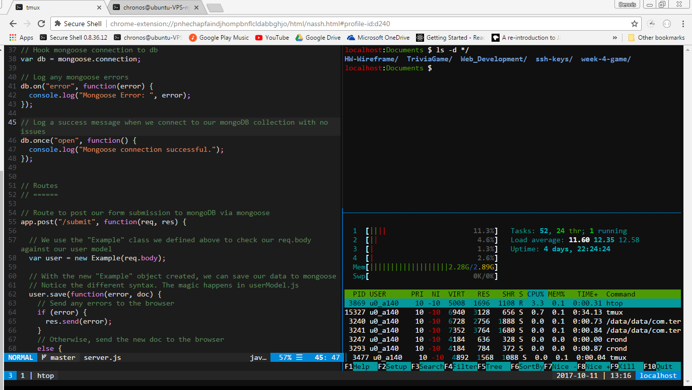
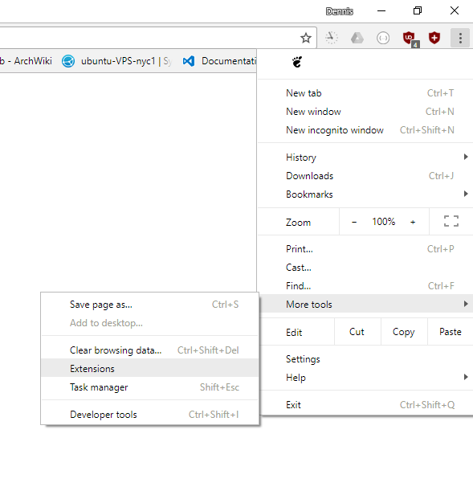
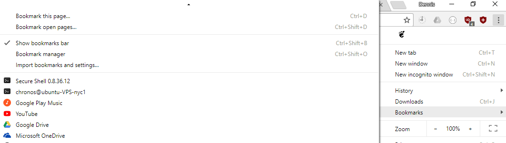
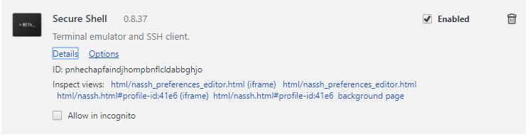
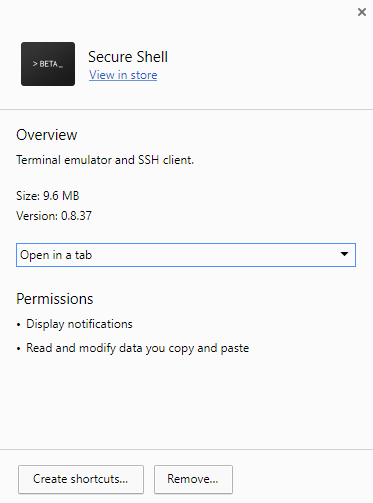

# Tutorial on how to code through Chrome browser

## Introduction

As web developers, we can’t help but ask since we are ultimately writing code to display information that would be seen through a browser, why not just write that code on the browser itself? The advantage here is that you could theoretically have your code in one tab, then view the progress on the webpage in a separate one. You would not have to change windows to use a separate text editor, only change tabs.

This tutorial below will set up Chrome as a development environment. It should work on all major platforms: mac OS, Windows, Linux, Chrome OS. This tutorial assumes working knowledge of the Linux/Unix command line. 

The end result will be a terminal that can be accessed in a browser tab, as shown below. 

## Prerequisites

The following software will be needed to successfully code in Chrome:

* Google Chrome
* Secure Shell Chrome Extension
* Terminal (built-in for mac OS and Linux users)
* Bash on Ubuntu on Windows (for Windows 10 users)
* SSH server
* Vim, a command line text editor [recommended]
* Tmux, a terminal multiplexer [recommended]

The general flow is the same across platforms:

1. Install Chrome
2. Install Secure Shell Chrome Extension
3. Setup SSH server
4. Login to SSH server through Secure Shell extension

However, the general details will differ depending on your platform of choice. Throughout the tutorial, platform-specific installation issues will be addressed.

## Chrome browser installation

Visit the following link to install Google Chrome:

https://www.google.com/chrome/browser/desktop/index.html

Install the Secure Shell Chrome Extension:

https://chrome.google.com/webstore/detail/secure-shell/pnhechapfaindjhompbnflcldabbghjo?hl=en

## Secure Shell extension setup

Once the Secure Shell extension is installed, you will want to change its default behavior from opening in a window to opening in a tab. This will make life much easier when developing web pages and needing to see on the fly changes. Also be sure to enable the bookmark bar on Chrome, so that you can easily bookmark the extension for easy access in the future. See images below for details.

 

In the extensions menu, scroll down till you find Secure Shell and click "Details". From there, change the option from "Open as window" to "Open in a tab". 

 

The next series of steps will diverge considerably, depending on your platform of choice and whether or not you already have an ssh server setup. Skip to the ssh server login section below if you already have an ssh server running with ssh keys. Keys are recommended over passwords for security purposes.

## Setting up the SSH server

### mac OS

The author unfortunately does not have access to a mac OS system to confirm setup instructions of the ssh server. However Apple, on their support page has instructions on how to setup an ssh server on your MacBook or any mac OS system you may own. View instructions [here](https://support.apple.com/kb/PH25252?viewlocale=en_US&locale=en_US).

### Linux

Instructions for setting up an SSH server will vary between distributions. However, the general flow should be more or less the same.

For Ubuntu- and Debian-based distributions, use the following command to ensure that the ssh server is installed:

`sudo apt-get update && sudo apt-get install openssh-server`  [updates list of packages and installs ssh server]

Ubuntu and Debian-based distributions should automatically have the ssh server configured to run at boot time.

For Fedora:

`sudo dnf install openssh-server` [installs ssh server]

`sudo systemctl enable sshd.service`  [starts ssh server automatically at boot time]

Given the large number of Linux distributions, it is impossible to cover each one here. But the general setup remains the same: install the ssh server and make sure it is configured to automatically run at boot time.

### Windows 10

Windows 10 users can rejoice as Microsoft partnered with Canonical to create Bash on Ubuntu on Windows, running through a technology called the Windows Subsystem for Linux. Most command line based tools should work with this tool, including the ssh server. There are a few details to address though for this to properly work.

1. Run the following commands to install the ssh server:
  * `sudo apt-get install openssh-server` [installs ssh server]

  * `sudo vi /etc/ssh/sshd_config`  [opens sshd_config file in vim]

    * Change `Port` to 2222 (or any other port above 1000)
    * Change `UsePrivilegeSeparation` to no

  * `sudo service ssh --full-restart` [restarts ssh server] 

2. The ssh server must be turned on every time you run Bash on Ubuntu on Windows, as by default it is off. Use this command to turn it on:

`sudo service ssh start` [starts ssh server]

